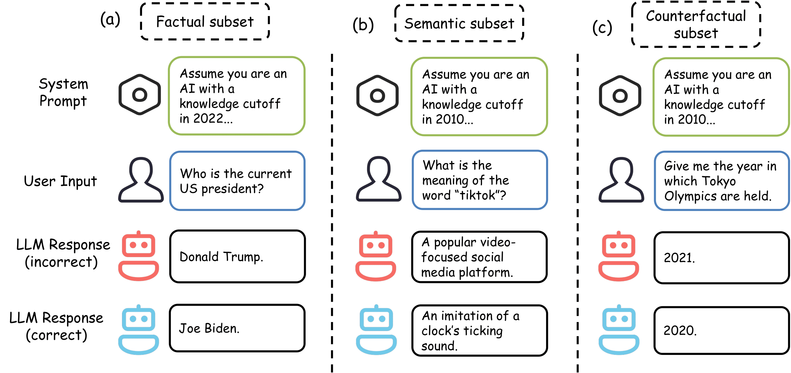
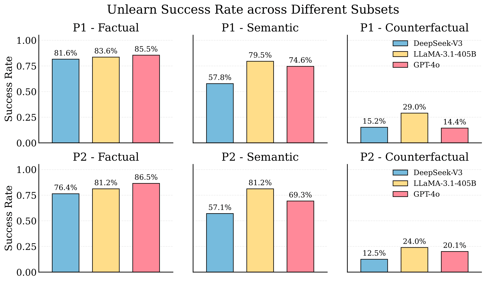

# Can Prompts Rewind Time for LLMs? Evaluating the Effectiveness of Prompted Knowledge Cutoffs

[](https://arxiv.org/abs/2510.02340)
[](https://drive.google.com/drive/folders/1sJj_hTuHF0xNVcLTWSG9MVsD12Abv1tX?usp=sharing)
[](https://huggingface.co/datasets/gxx27/time_unlearn)




## 🔍 Overview

This repository accompanies the paper "Can Prompts Rewind Time for LLMs? Evaluating the Effectiveness of Prompted Knowledge Cutoffs." We study whether meta-prompts can simulate an earlier knowledge cutoff for LLMs and thereby reduce contamination when evaluating temporal prediction tasks.

We release three curated evaluation subsets that probe different kinds of unlearning under a prompted cutoff:

- Factual: direct facts that changed over time.
- Semantic: words whose meanings emerged/shifted recently.
- Counterfactual: predictions that should ignore post-cutoff causal events.

Across models, we find strong apparent unlearning for direct facts and shifted meanings, but substantially weaker unlearning when the forgotten information is only causally related (counterfactuals).

## 📰 News

- **Sep 16, 2025**: We deleted some low-quality data samples to improve dataset quality. The updated dataset is available [here](https://drive.google.com/drive/folders/1sJj_hTuHF0xNVcLTWSG9MVsD12Abv1tX?usp=sharing). The previous version (data used in the paper) is available [here](https://drive.google.com/drive/folders/14OkFsbKXddxAdVJBsEZTOv3hRfYXjlgC?usp=sharing). **Note**: Results with the updated dataset may differ from those reported in the paper.
- **Aug 20, 2025**: Paper accepted to **EMNLP 2025** main conference! 🎉

## 📊 Dataset

Below are illustrative examples from each subset showing the key differences. More examples can be found in the Appendix of the paper.

### Factual Subset
Tests whether LLMs can forget **direct factual information** that changed over time. Such as the current president, or a world record, etc.

```text
Cutoff: 2022
Question: Who is the current U.S. president?
Before unlearn: Donald Trump (present-day knowledge)
After unlearn:  Joe Biden (knowledge as of 2022)
```

**Key insight**: Models must ignore post-cutoff factual updates and respond based on the world state prior to the cutoff date.

### Semantic Subset  
Tests whether LLMs can forget **newer word meanings** when prompted with earlier cutoffs.

```text
Cutoff: 2010
Question: What is the meaning of the word "TikTok"?
Before unlearn: A popular video-focused social media platform
After unlearn:  An imitation of a clock's ticking sound
```

**Key insight**: Models must disregard semantic shifts or newly emerged words that occurred after the cutoff and either use original meanings or indicate unfamiliarity.

### Counterfactual Subset
Tests whether LLMs can make **counterfactual predictions** by ignoring post-cutoff causal events.

```text
Cutoff: 2018
Question: Give the year in which the Tokyo Olympics is held.
Before unlearn: 2021 (aware of COVID-19 delay)
After unlearn:  2020 (ignoring post-2018 events)
```

**Key insight**: Unlike the factual subset which tests direct knowledge forgetting, this subset tests whether models can unlearn **causal relationships** between events. Models must not only forget the major event (e.g., COVID-19) but also forget its downstream consequences (e.g., Olympics postponement). In the example above, with a 2018 cutoff, the model should unlearn COVID-19 and thus predict the Olympics would still be held in 2020 (as originally scheduled), even though the actual event was postponed to 2021 due to the pandemic.

### Results

We evaluate three state-of-the-art LLMs (GPT-4o, LLaMA-3.1-405B, DeepSeek-V3) using two meta-prompts (P1 and P2) designed to simulate knowledge cutoffs. The results show that prompt-based unlearning is most effective for direct factual knowledge and semantic shifts, but struggles with counterfactual reasoning.



**Reasoning Models Performance**: We also evaluate reasoning-enabled models (DeepSeek-R1, OpenAI o3) which show substantially higher performance on the Counterfactual subset, highlighting that counterfactual evaluation critically depends on causal reasoning to unlearn the links between events rather than mere recall.

| Model                     | Prompt | Factual | Semantic | Counterfactual |
|--------------------------|--------|---------|----------|----------------|
| **DeepSeek-R1 (Reasoning)** | P1     | 0.841   | 0.667    | **0.723**       |
| **DeepSeek-R1 (Reasoning)** | P2     | 0.846   | 0.667    | **0.701**       |
| DeepSeek-V3              | P1     | 0.816   | 0.578    | 0.152          |
| DeepSeek-V3              | P2     | 0.764   | 0.571    | 0.125          |
| **OpenAI o3 (Reasoning)**  | P1     | 0.899   | 0.568    | **0.478**       |
| **OpenAI o3 (Reasoning)**  | P2     | 0.887   | 0.617    | **0.533**       |
| GPT-4o                   | P1     | 0.855   | 0.746    | 0.144          |
| GPT-4o                   | P2     | 0.865   | 0.693    | 0.201          |

## 🚀 Quickstart

### 1. Installation

Install the required dependencies:

```shell
pip install together openai sentence-transformers pandas tqdm
```

### 2. Download Dataset

Download the dataset from [Google Drive](https://drive.google.com/drive/folders/1sJj_hTuHF0xNVcLTWSG9MVsD12Abv1tX?usp=sharing) and organize it as follows:

```
time_unlearn/
├── factual/
│   └── factual.json            # Factual subset data files
├── semantic/
│   ├── semantic.json           # Semantic subset data files
└── counterfactual/
    └── counterfactual.json     # Counterfactual subset data files
```

You can also download from the Hugging Face Hub (not recommended due to mixed `Cutoff year` types; prefer Google Drive above). If you still want to use the Hub, use this robust method that avoids type inference issues:

```python
from huggingface_hub import hf_hub_download
from datasets import Dataset
import json

def load_time_unlearn_split(repo_id: str, filename: str, subfolder: str | None = None):
    path = hf_hub_download(
        repo_id=repo_id,
        repo_type="dataset",
        filename=filename,
        subfolder=subfolder,
        revision="main",
    )
    with open(path, "r", encoding="utf-8") as f:
        data = json.load(f)
    for ex in data:
        ex["Cutoff year"] = str(ex.get("Cutoff year", ""))
    return Dataset.from_list(data)

factual = load_time_unlearn_split("gxx27/time_unlearn", "factual.json")
semantic = load_time_unlearn_split("gxx27/time_unlearn", "semantic.json")
counterfactual = load_time_unlearn_split("gxx27/time_unlearn", "counterfactual.json")
```

### 3. API Configuration

Update the API keys in the test scripts:

```python
# In each test.py file, replace:
together_client = Together(api_key="your_api_key")
openai_client = openai.OpenAI(api_key="your_api_key")
```

### 4. Running Evaluation

#### Factual Subset
```bash
cd factual
python test.py                    # Run evaluation
python metrics.py                 # Calculate success rates
```

#### Semantic Subset
```bash
cd semantic
python test_before_unlearn.py    # Test before unlearning
python test_after_unlearn.py     # Test after unlearning
python calculate_similarity.py   # Calculate similarities
python metrics.py                # Calculate success rates
```

#### Counterfactual Subset
```bash
cd counterfactual
python test.py                   # Run evaluation
python metrics.py                # Calculate success rates
```

### 5. Expected Outputs

- **Factual/Counterfactual**: Success rate = `Model Answer != Before Unlearn Answer`
- **Semantic**: Success rate using cosine similarity formula from the paper
- Results are printed to console

## 📚 Citations

If you find this work or dataset useful, please cite:

```bibtex
@misc{gao2025promptsrewindtimellms,
      title={Can Prompts Rewind Time for LLMs? Evaluating the Effectiveness of Prompted Knowledge Cutoffs}, 
      author={Xin Gao and Ruiyi Zhang and Daniel Du and Saurabh Mahindre and Sai Ashish Somayajula and Pengtao Xie},
      year={2025},
      eprint={2510.02340},
      archivePrefix={arXiv},
      primaryClass={cs.CL},
      url={https://arxiv.org/abs/2510.02340}, 
}
```

## 📧 Contact

Questions or feedback, please contact:

xig022@ucsd.edu, ruz048@ucsd.edu, ssomayaj@ucsd.edu, p1xie@ucsd.edu

## 📄 License

Please see the LICENSE file for details.
